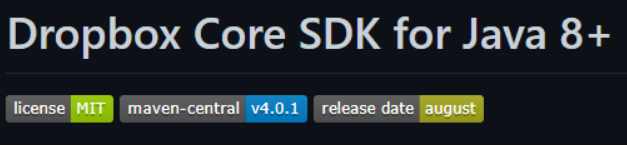

# README

O README é um arquivo com extensão .md, ou seja, ele é escrito em **Markdown** que é uma linguagem de marcação utilizada para converter o texto em um HTML válido. 

Nas plataformas de repositórios remotos, como o GitHub, a função desse arquivo é apresentar informações do projeto, como:

* Descrição do seu projeto;
* Funcionalidades;
* Como os usuários podem utilizá-lo;
* Onde os usuários podem encontrar ajuda sobre seu projeto;
* Autores do projeto.

**Dica**: Podemos usar emojis, como os [deste repositório](https://gist.github.com/rxaviers/7360908).

### Roteiro Padrão

* Título e Imagem de Capa

```
(Opção 1) 
# Seu título aqui 

(Opção 2 - Centralizado)
<h1 align="center"> Seu título aqui </h1>

(Opção 3 - Imagem de Capa)

```

* Badges

São insígnias que indicam o estado atual do projeto, licença caso tenha, versões, dependências, testes etc.

Ex: 


**Site de Geração de Bagdes**: [shields.io](https://shields.io/)

* Índice

É feito automaticamente pelo GitHub, mas também pode ser feito em Markdown usando a mesma sintaxe da importação de imagens.

* Descrição do Projeto

É uma breve explicação do seu projeto com seu objetivo principal. Você pode adotar uma descrição mais objetiva, ou pode detalhar mais, apresentando figuras que exemplificam o projeto, caso tenha.

* Status do Projeto

Utilizado caso as badges não tenham sido utilizadas.

* Funcionalidades e Demonstração da Aplicação

Lista as funcionalidades do seu projeto para facilitar o entendimento do usuário. Se possível, é interessante apresentar as funcionalidades com um exemplo visual do projeto, como gif, imagens ou vídeo.

**GIFs**: Podem ser gravados com [Acethinker](https://www.acethinker.com.br/gravador-de-tela-gratis-online)

* Acesso ao Projeto

Indica como o usuário pode baixar o projeto, abrir e executar.

* Tecnologias utilizadas

Lista as tecnologias utilizadas no projeto

* Contribuidores e Desenvolvedores

Lista as pessoas envolvidas com o projeto, com fotos.

Ex:

| [<br><sub>Camila Fernanda Alves</sub>](https://github.com/camilafernanda) |  [<br><sub>Guilherme Lima</sub>](https://github.com/guilhermeonrails) |  [<br><sub>Alex Felipe</sub>](https://github.com/alexfelipe) |
| :---: | :---: | :---: |

* Licença

Para que um repositório seja realmente de código aberto, ele precisa obter uma [licença](https://docs.github.com/pt/repositories/managing-your-repositorys-settings-and-features/customizing-your-repository/licensing-a-repository) para que outros tenham a liberdade de usar, alterar e distribuir o software.

Portanto, caso seu repositório tenha uma licença, é essencial que você coloque ela no seu README. 

**Fonte: [Alura](https://www.alura.com.br/artigos/escrever-bom-readme)** 