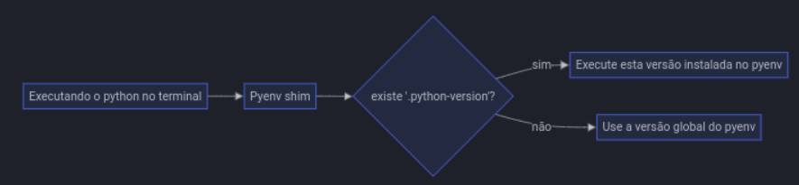

# pyenv

O `pyenv` é uma aplicação externa ao Python que permite isolar todas as instalações do Python da sua máquina. 

Para isso, o `pyenv` utiliza o conceito de shim, que é uma camada que redireciona todas as chamadas do comando `python` para uma versão previamente fixada pelo Pyenv, como se fosse uma proxy.



## Casos de uso 

### Instalação de uma versão específica do Python

```tsx
pyenv install 3.12:latest
```

### Visualização das versões do Python instaladas

```tsx
pyenv versions
```

### Ativando uma versão do Python globalmente

```tsx
pyenv global 3.12.1
```

### Ativando uma versão do Python em um projeto

O comando vai criar um arquivo oculto chamado `.python-version` na raiz do projeto.

```tsx
pyenv local 3.12.1
```

## Configuração do pyenv

https://github.com/pyenv/pyenv-installer?tab=readme-ov-file

### Instalação

Primeiro, baixamos os arquivos

```tsx
curl https://pyenv.run | bash
```

Depois, configuramos o `pyenv` como função no terminal e criamos sua variável de ambiente, habilitando o shim e autocomplete

```tsx
echo 'export PYENV_ROOT="$HOME/.pyenv"' >> ~/.bashrc
echo 'command -v pyenv >/dev/null || export PATH="$PYENV_ROOT/bin:$PATH"' >> ~/.bashrc
echo 'eval "$(pyenv init -)"' >> ~/.bashrc

echo 'export PYENV_ROOT="$HOME/.pyenv"' >> ~/.bash_profile
echo 'command -v pyenv >/dev/null || export PATH="$PYENV_ROOT/bin:$PATH"' >> ~/.bash_profile
echo 'eval "$(pyenv init -)"' >> ~/.bash_profile
```

### Atualização

```tsx
pyenv update
```

### Desinstalação
 
```tsx
rm -fr ~/.pyenv
```


